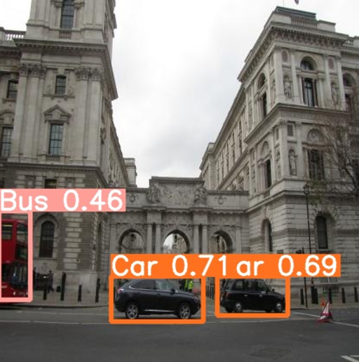
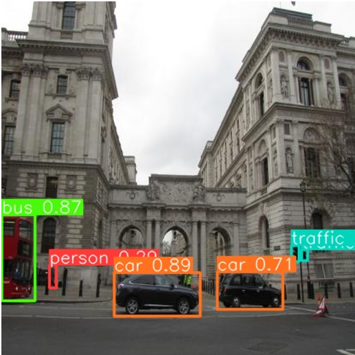

# Comparing YOLO Models: YOLOv5 vs YOLOv8

## Key Differences Between YOLOv5 and YOLOv8

1. **Backbone Architecture**:  
   YOLOv8 utilizes a different backbone architecture compared to YOLOv5. The choice of backbone architecture significantly impacts the model's ability to extract features from input images.

2. **Training Methodology**:  
   The training methodologies for YOLOv8 and YOLOv5 may differ, including the specific data augmentation techniques, optimization algorithms, and learning rate schedules used during the training process.

3. **Model Complexity and Efficiency**:  
   - YOLOv8 may prioritize accuracy improvements at the cost of increased computational complexity.  
   - YOLOv5 aims for a balance between accuracy and efficiency, targeting real-time inference on resource-constrained devices.

---

## Performance Comparison

The performance of both models on the same test set is as follows:

- **YOLOv5**:
  - Precision and Recall: Approximately 0.5 – 0.6  
  - mAP (mean Average Precision) and mAP50-95: Ranges between 0.3 – 0.6
    

- **YOLOv8**:
  - Precision and Recall: Approximately 0.5 – 0.7  
  - mAP: Ranges between 0.4 – 0.7
    

## Conclusion

After thorough examination and analysis, it can be conclusively stated that **YOLOv8 exhibits superior performance compared to YOLOv5** in the task of object detection within images. Key observations include:

- YOLOv8's improved architecture plays a crucial role in enhancing its object detection capabilities.
- YOLOv8 achieves higher accuracy (with increase in computation time) compared to YOLOv5 .
- It can be concluded that YOLOv8's superior accuracy solidifies its position as the preferred choice for object detection tasks.
